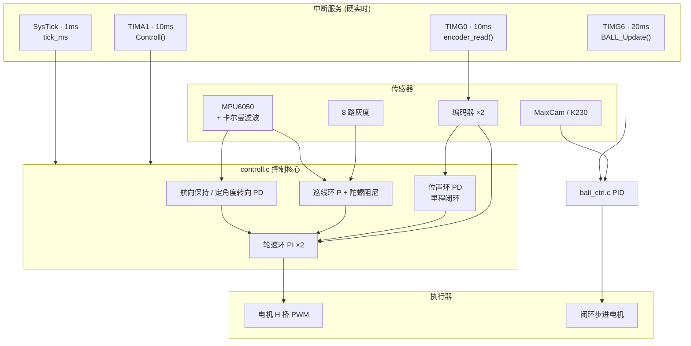

# MSPM0 电赛小车 · 2026 电赛 F 题

> 基于 **TI MSPM0G3507** 的电赛小车 / 球平衡平台完整源码
> 灰度巡线 + 编码器里程闭环 + MPU6050 航向保持 + 视觉球平衡


---

## 目录

- [项目简介](#项目简介)
- [功能特性](#功能特性)
- [硬件平台](#硬件平台)
- [引脚分配](#引脚分配)
- [软件架构](#软件架构)
- [目录结构](#目录结构)
- [外设驱动支持](#外设驱动支持)
- [快速上手](#快速上手)
- [任务与操作说明](#任务与操作说明)
- [串口在线调参](#串口在线调参)
- [调试与可视化](#调试与可视化)
- [当前状态与后续计划](#当前状态与后续计划)
- [开源与致谢](#开源与致谢)

---

## 项目简介

本仓库是 **2026 年全国大学生电子设计竞赛 F 题** 的完整下位机源码，主控为 TI **MSPM0G3507**（ARM Cortex-M0+，80 MHz）。

小车底盘的运动控制（轮速环 / 位置环 / 巡线环 / 航向环）已经**调参完成并稳定运行**；姿态解算使用 MPU6050 + **自研卡尔曼滤波**替代 DMP，初始化时间大幅缩短，静动态性能稳定。虽然受限于低成本陀螺仪本身的零漂与噪声，极限精度有限，但对于电赛常规场景**已经足够**。

此外，仓库内还整理了一批**电赛常用外设的通用驱动**（多种 IMU、OLED、激光测距、超声波、视觉串口等），可直接复用到其他 MSPM0 项目中。

> 📐 **PCB 原理图与接线图已开源，见 [`docs/`](docs/) 目录** —— 所有连线（电源、电机驱动、编码器、传感器、UART 分配）均可在其中查到，硬件可 1:1 复刻。

---

## 功能特性

### 运动控制（已调通）

- ✅ **左右轮独立增量式 PI 速度环**，带一阶低通滤波与抗积分饱和、死区补偿
- ✅ **位置环（PD）**：编码器里程闭环，支持「走 N cm → 自动减速停车」与到位判定
- ✅ **8 路灰度巡线**：加权中心误差 P 项 + **陀螺仪阻尼 D 项**（自适应弯道阻尼），含丢线保持 / 长丢线回退策略
- ✅ **航向保持与定角度转向**：基于 MPU6050 yaw 的 PD 控制，含误差过零处理
- ✅ **斜坡加减速**：任务起步/停车平滑，防止打滑与过冲
- ✅ **急停复位**：`stop_motion()` 一键清零全部运动状态与 PID 积分

### 姿态解算（重点改进）

- ✅ **MPU6050 + 卡尔曼滤波**（状态量 `[angle, bias]`），替代官方 DMP
  - 初始化时间显著缩短，上电即可用
  - 静态零漂抑制良好，动态跟踪稳定
  - 200 Hz FIFO 采样
- ⚠️ 受低成本 MEMS 陀螺仪本身性能限制，长时间积分仍会漂移，但**满足电赛需求**；如需更高精度可切换到仓库内其他 IMU 驱动（见下文）

### 球平衡 / 云台

- ✅ 视觉偏差（MaixCam / K230，UART）→ **位置式 PID** → 闭环步进电机（UART 总线驱动器）
- ✅ 50 Hz 固定 `dt` 控制、抗积分饱和、输出死区、命令限频、相机丢帧保护
- 🚧 步进电机闭环驱动部分仍在继续完善中

### 调试与工具

- ✅ SSD1306 OLED 实时显示任务号 / 运行状态 / 计时
- ✅ **VOFA+ 串口在线调参**，所有 PID 参数运行时修改，无需重新烧录
- ✅ 秒表计时、按键任务切换、VOFA 波形输出

---

## 硬件平台

| 项目 | 规格 |
| --- | --- |
| MCU | MSPM0G3507（LQFP-64），Cortex-M0+ @ **80 MHz** |
| 时钟 | 外部 HFXT 40 MHz → SYSPLL → CPUCLK 80 MHz |
| SDK | MSPM0-SDK `2.10.00.04`，SysConfig `1.26.2` |
| 电机 | MG513 减速电机（1:30），霍尔编码器 13 线 × 4 倍频 = **1560 脉冲/圈** |
| 轮径 | 6.5 cm |
| 电机驱动 | PWM + 双方向 GPIO（H 桥接口），**20 kHz** PWM |
| 主控舵机/步进 | UART 总线闭环步进驱动器（自定义字节协议，115200） |
| 视觉 | MaixCam / K230，UART **115200 8N1** |
| 循迹 | 8 路数字灰度传感器（独立 GPIO 直读） |
| 显示 | SSD1306 OLED 128×64，硬件 I2C **400 kHz** |
| 调试 | SWD（PA19/PA20）+ VOFA+ 串口 |

---

## 引脚分配

> 完整网表 / 原理图请见 [`docs/`](docs/)。

| 功能 | 外设 | 引脚 |
| --- | --- | --- |
| 电机 PWM 左 / 右 | TIMA0 CH0 / CH1 | PB14 / PA7 |
| 电机方向 左 AIN1/AIN2 | GPIO | PB7 / PB6 |
| 电机方向 右 BIN1/BIN2 | GPIO | PB9 / PB10 |
| 编码器 左 A/B | GPIO 中断 | PB4 / PB5 |
| 编码器 右 A/B | GPIO 中断 | PB11 / PB12 |
| 灰度传感器 ×8 | GPIO | PB19, PB17, PA16, PA14, PB20, PB25, PA25, PA27 |
| MPU6050 I2C | I2C1 | SDA=PB3, SCL=PB2, INT=PB1 |
| OLED I2C | I2C0 | SDA=PA0, SCL=PA1 |
| 相机串口 | UART3 | RX=PA13, TX=PA26 |
| 步进驱动器 | UART1 | TX=PA8, RX=PA9 |
| VOFA+ 调参 | UART2 | TX=PB15, RX=PB16 |
| 按键 KEY1/2/3 | GPIO | PA23 / PA21 / PB18 |
| LED | GPIO | PA22 |

### 定时器分配

| 定时器 | 用途 | 周期 |
| --- | --- | --- |
| TIMA0 | 电机 PWM | 20 kHz |
| TIMA1 | `Controll()` 运动控制主中断 | **10 ms / 100 Hz** |
| TIMG0 | `encoder_read()` 编码器测速刷新 | 10 ms / 100 Hz |
| TIMG6 | `BALL_Update()` 球平衡控制 | **20 ms / 50 Hz** |
| SysTick | `tick_ms` 毫秒时基 | 1 ms |

---

## 软件架构



**分层设计**

- `Drivers/` —— 与业务无关的外设驱动（IMU / OLED / 测距 / 串口等）
- `mycode/` —— 与赛题强相关的业务逻辑（控制环、任务状态机、调参协议）
- `main.c` —— 初始化 + 主循环任务调度 + OLED 状态刷新
- `mspm0-modules.syscfg` —— SysConfig 图形化配置（引脚/时钟/外设生成的唯一入口）

---

## 目录结构

```text
mspm0-modules/
├── main.c / main.h              # 入口：外设初始化、主循环任务调度
├── mspm0-modules.syscfg         # SysConfig 配置（引脚/时钟/外设）
├── targetConfigs/               # CCS 调试目标配置 (.ccxml)
├── docs/                        # 📐 PCB 原理图 / 接线图 / 硬件开源文件
├── Drivers/                     # 外设驱动（与赛题解耦，可复用）
│   ├── MSPM0/                   #   SysTick 时基、中断统一管理
│   ├── MPU6050/                 #   六轴 IMU + DMP + 卡尔曼滤波
│   ├── LSM6DSV16X/              #   ST 六轴 IMU
│   ├── IMU660RB/                #   六轴 IMU + Madgwick AHRS
│   ├── BNO08X_UART_RVC/         #   BNO08X UART-RVC 模式
│   ├── WIT/                     #   维特智能 IMU（串口）
│   ├── VL53L0X/                 #   ToF 激光测距
│   ├── Ultrasonic_GPIO/         #   HC-SR04 类超声波
│   └── OLED_*/                  #   SSD1306 四种接口实现
└── mycode/                      # 业务代码（赛题相关）
    ├── controll.c/h             #   ★ 运动控制核心：速度/位置/巡线/航向环
    ├── ball_ctrl.c/h            #   ★ 球平衡 PID（视觉 → 步进角度）
    ├── task.c/h                 #   ★ 任务状态机 task_1~task_6
    ├── gimbal_task.c            #   云台/球平衡 20ms 中断执行体
    ├── stepper.c/h              #   闭环步进驱动器 UART 协议封装
    ├── camera_uart.c/h          #   视觉模块串口帧解析
    ├── grayscale_sensor.c/h     #   8 路灰度读取
    ├── encoder.c/h              #   正交解码 + 速度刷新
    ├── motor.c/h                #   电机 PWM/方向输出
    ├── button.c/h               #   按键消抖 + 任务模式切换
    ├── PID_DEBUG.c/h            #   ★ 串口在线调参协议
    ├── vofa.c/h                 #   printf 重定向 + JustFloat 协议
    ├── uart.c/h / Delay.c/h     #   串口/延时工具
    ├── stopwatch.c/h            #   秒表
    └── test_stepper.c           #   步进电机独立测试（默认不编译）
```

---

## 外设驱动支持

`Drivers/` 下所有驱动均已实现并经过实测，但 **`.cproject` 默认只编译本赛题用到的三个目录**（`MPU6050`、`MSPM0`、`OLED_Hardware_I2C`），其余为可选，去掉 `.cproject` 中的排除项即可启用：

| 驱动 | 接口 | 默认编译 |
| --- | --- | :---: |
| MPU6050 + Kalman | I2C + INT | ✅ |
| MSPM0（clock / interrupt） | 内部 | ✅ |
| OLED SSD1306 Hardware I2C | I2C 400 kHz | ✅ |
| OLED SSD1306 Software I2C | GPIO 模拟 | ➖ |
| OLED SSD1306 Hardware SPI | SPI 10 MHz | ➖ |
| OLED SSD1306 Software SPI | GPIO 模拟 | ➖ |
| LSM6DSV16X | I2C + INT | ➖ |
| IMU660RB + Madgwick Fusion | SPI | ➖ |
| BNO08X UART-RVC | UART + DMA | ➖ |
| WIT 维特智能 IMU | UART + DMA | ➖ |
| VL53L0X ToF 测距 | I2C + XSHUT | ➖ |
| HC-SR04 超声波 | GPIO TRIG/ECHO | ➖ |

---

## 快速上手

### 环境要求

- **Code Composer Studio (CCS)** 20.x（或带 TI Clang 工具链的 CCS Theia）
- **MSPM0-SDK 2.10.00.04**
- **SysConfig 1.26.2**
- 可选：[VOFA+](https://www.vofa.plus/) 用于波形观察与在线调参

### 编译与烧录

1. 打开 CCS，`File → Import → CCS Projects`，选择本仓库根目录导入工程（工程名 `empty_LP_MSPM0G3507_nortos_ticlang`）。
2. 双击 `mspm0-modules.syscfg` 确认引脚/时钟配置（换板需按 [`docs/`](docs/) 重新映射）。
3. `Project → Build`，然后连接 XDS 调试器 / 板载 SWD 烧录。
4. 上电后 OLED 显示 `Init OK` 即初始化成功。

### 命令行构建（可选）

```bash
cd Debug
gmake -k -j 20 all -r -O     # 需 TI CCS 自带 gmake
```

> ⚠️ `Debug/` 为构建产物目录，已被 `.gitignore` 忽略。新克隆的仓库需**先用 CCS 构建一次**，生成 `makefile` 与 `ti_msp_dl_config.c/h` 后，才能直接使用上面的 `gmake` 命令。

---

## 任务与操作说明

### 按键操作

| 按键 | 引脚 | 功能 |
| --- | --- | --- |
| KEY1 | PA23 | **复位归位**（清里程、清 PID、急停，执行 `g_home_request`） |
| KEY2 | PA21 | **切换任务**（`task_1` → `task_6` 循环） |
| KEY3 | PB18 | **启动 / 停止**当前任务（`g_start_flag`） |

### 任务说明

| 任务 | 内容 |
| --- | --- |
| `task_1` | 预留占位 |
| `task_2` | 巡线行驶，检测到停车标志后停车；启动时里程清零对齐起点 |
| `task_3` | 球平衡相关任务（预留 / 与 `BallMode::BALL_TASK3` 对应） |
| `task_4` | 位置环定距行驶：缓慢加速 → 到达距离冻结计时 → 减速停车（每帧向相机发 `Q4`） |
| `task_5` | 巡线 → 检测停车标志 → 再前进固定距离后缓慢减速停车 |
| `task_6` | 同 `task_5` 逻辑，速度参数不同 |

### 相机通信协议

- **下位机 ← 相机**：`d<int>\n`（偏差像素，单位 px）
- **下位机 → 相机**：`Q3/Q4/Q5/Q6\n`（切换当前任务对应的识别模式）

---

## 串口在线调参

通过 VOFA+ 串口（UART2，115200）发送 `#XX=值` 即可在线修改参数，**无需重新烧录**：

| 命令前缀 | 含义 |
| --- | --- |
| `#Lp= #Li=` / `#Rp= #Ri=` | 左 / 右轮速度环 PI |
| `#Vp= #Vi=` | 左右轮同时设置速度环 PI |
| `#Ms=` | 目标速度 |
| `#Aa=` | 速度环滤波系数 |
| `#Hp= #Hd= #Hy=` | 航向保持 PD / yaw 目标 |
| `#Tp= #Td= #Ta=` | 定角度转向 PD / 目标角度 |
| `#Fp= #Fd= #Fg=` | 巡线 P / D / **陀螺仪阻尼** |
| `#Sp= #Sd=` | 位置环 PD |
| `#St= #Sr=` | 走 N cm / 位置清零 |
| `#Bp= #Bi= #Bd=` | 球平衡 PID |
| `#Bl= #BL=` | 球平衡角度限幅 / 积分限幅 |
| `#Dx=` | 模拟相机偏差（无相机时调试用） |

**应答**：`OK` / `ERR:01`（格式错误）/ `ERR:03`（未知命令）

---

## 调试与可视化

- **VOFA+**：`vofa.c` 将 `printf` 重定向至 UART2；已实现 **JustFloat** 二进制协议（`VOFA_JustFloat_Send1~4`），也支持直接输出逗号分隔文本供 FireWater 协议解析。
- **球平衡调试输出**：主循环以 50 Hz 打印 `BALL err=.. out=.. tgt=.. int=..`，对应 VOFA+ 四通道（误差 / 输出 / 目标角度 / 积分项）。
- **OLED**：实时显示当前任务、`RUN/IDLE` 状态与计时 `MM:SS.mmm`。
- **注释调试块**：`main.c` 主循环内保留多组被注释的 `printf` 调试输出，取消注释即可切换观察对象。

---

## 当前状态与后续计划

- ✅ 底盘速度环 / 位置环 / 巡线环 / 航向保持 —— **已调参完成，运行稳定**
- ✅ MPU6050 卡尔曼滤波姿态解算 —— **初始化快、静动态性能稳定**
- 🚧 步进电机闭环控制（球平衡执行机构）—— **仍在完善中**
- 📌 后续计划：完善球平衡全流程、补充视觉识别联动、整理更多外设示例

---

## 开源与致谢

- 📐 **硬件开源**：[`docs/`](docs/) 内含 PCB 原理图与接线图，可直接复刻硬件。
- 📄 **第三方代码**：
  - InvenSense eMPL / DMP 驱动 —— 版权归 InvenSense（TI/InvenSense 许可）
  - ST VL53L0X / LSM6DSV16X 官方 API —— 版权归 STMicroelectronics
  - Madgwick AHRS（`Drivers/IMU660RB/Fusion`）—— 见其目录下 `LICENSE.md`
  - TI MSPM0-SDK 生成代码（`ti_msp_dl_config.*`）—— 版权归 Texas Instruments
- 🙏 感谢 TI MSPM0 生态与开源社区。

> 本项目源码仅供学习与竞赛交流使用，请遵守各第三方组件的原始许可协议。

---

<div align="center">

**如果这个项目对你有帮助，欢迎点一个 ⭐ Star！**

</div>
